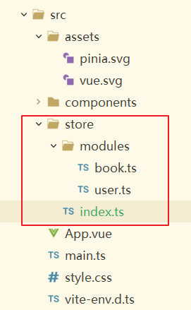
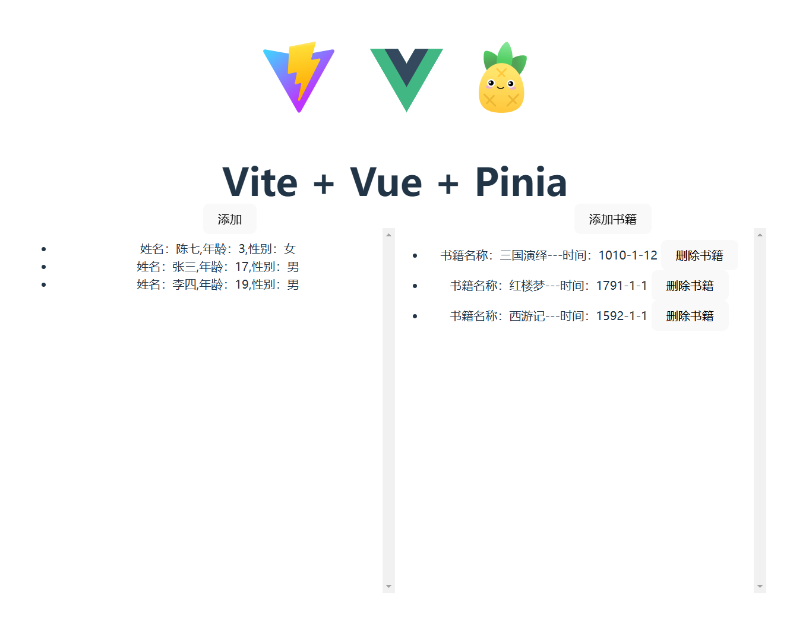

# Vue 3 + TypeScript + Vite + Pinia


## 安装

```shell
npm install pinia
```

## 引入

```typescript
import { createApp } from 'vue'
import { createPinia } from 'pinia'
import App from './App.vue'

const pinia = createPinia()
const app = createApp(App)

app.use(pinia)
app.mount('#app')
```

## 模块定义

先创建目录文件。如下



book.ts

```ts
import { defineStore } from 'pinia';

interface Book {
  name: string; // 书籍名称
  time: string; // 书籍相关的时间，如出版时间等
  id: string; // 书籍的id
}

interface State {
  bookList: Book[]; // 书籍列表，包含多个 Book 对象
}

const useBookStore = defineStore('book', {
  state: (): State => ({
    bookList: [
      {
        name: '三国演绎',
        time: '1010-1-12',
		id: '2025111'
      },
      {
        name: '红楼梦',
        time: '1791-1-1',
		id: '2025114'
      },
      {
        name: '西游记',
        time: '1592-1-1',
		id: '2025115'
      }
    ]
  }),
  getters: {
    // 示例 getter，获取书籍数量
    bookCount: (state) => state.bookList.length
  },
  actions: {
    // 示例 action，添加书籍到列表
    addBook(book: Book) {
      this.bookList.push(book);
    },
    // 示例 action，删除书籍
    removeBook(bookId: string) {
      this.bookList = this.bookList.filter(book => book.id !== bookId);
    }
  }
});

export default useBookStore;
```

user.ts

```ts
import { defineStore } from 'pinia';

interface User {
  name: string;
  age: number;
  gender: string;
}

const useUserStore = defineStore("user", {
  state: () => ({
    userList: [
      {
        name: "张三",
        age: 17,
        gender: "男"
      },
      {
        name: "李四",
        age: 19,
        gender: "男"
      },
      {
        name: "陈七",
        age: 3,
        gender: "女"
      }
    ]
  }),
  getters: {
    sortedUserList: (state) => {
      return [...state.userList].sort((a, b) => a.age - b.age);
    }
  },
  actions: {
    // actions 用来修改 state
    setUser(user: User) {
      this.userList.push(user);
    }
  }
});

export default useUserStore;
```

index.ts

```ts
import useUserStore from './modules/user';
import useBookStore from "./modules/book"

export default function useStore(){
    return {
        user:useUserStore(),
		book:useBookStore()
    }
}

```

## 组件中使用

```vue
<script setup lang="ts">
import useStore from '../store';
import { reactive } from 'vue';

defineProps<{ msg: string }>();
const { user, book } = useStore();

let userInfo = reactive({
	name: '添加的用户',
	age: 0,
	gender: '男'
});

let bookInfo = reactive({
	name: '添加的用户',
	time: '2025-1-10',
	id: '00000'
});

function addUser() {
	// 获取随机的年龄和用户名
	let userName = `添加的用户${user.userList.length + 1}`;
	let age = Math.ceil(Math.random() * 100);
	let gender = '男';

	userInfo = {
		name: userName,
		age: age,
		gender: gender
	};

	user.setUser(userInfo);
}

function addBook() {
	// 获取随机的年龄和用户名
	let bookName = `添加的书籍${book.bookCount + 1}`;

	bookInfo = {
		name: bookName,
		time: `${Math.ceil(Math.random() * 3000 + 1)}-${Math.ceil(Math.random() * 12 + 1)}-${Math.ceil(Math.random() * 30 + 1)}`,
		id: `${Math.random().toString(36).substr(2, 8)}`
	};

	book.addBook(bookInfo);
}

function delBook(name: string) {
	book.removeBook(name);
}
</script>

<template>
	<h1>{{ msg }}</h1>

	<div class="out">
		<div class="user">
			<button @click="addUser" class="option-btn">添加</button>
			<ul>
				<li v-for="item in user.sortedUserList">姓名：{{ item.name }},年龄：{{ item.age }},性别：{{ item.gender }}</li>
			</ul>
		</div>

		<div class="book">
			<button @click="addBook" class="option-btn">添加书籍</button>
			<ul>
				<li v-for="item in book.bookList">
					书籍名称：{{ item.name }}---时间：{{ item.time }}
					<button @click="delBook(item.id)">删除书籍</button>
				</li>
			</ul>

			<!-- <div>{{ book.bookList }}</div> -->
		</div>
	</div>
</template>

<style scoped>
.read-the-docs {
	color: #888;
}
.out {
	display: flex;
	flex-direction: row;
}

.user,
.book{
	width: 500px;
	flex: 1;
	height: 50vh;
	overflow-y: scroll;
}

.option-btn {
	position: fixed;
	top: 350px;
}

</style>
```

效果如下



